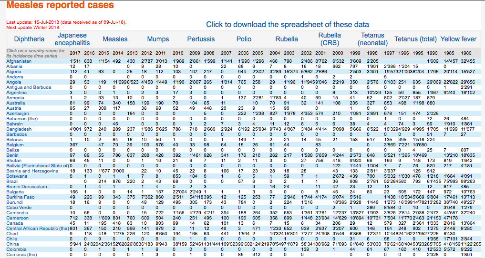

```{r setup, include=FALSE}
options(width = 100)
knitr::opts_chunk$set(
  collapse = TRUE,
  comment = "#>",
  out.width = "100%"
)

suppressPackageStartupMessages(library(tidyverse))
library(countrycode)
library(emo)
library(here)
library(janitor)
library(leaflet)
library(readxl)
library(rnaturalearth)
library(rvest)
```

# Disease incidence and immunization coverage: An exercise in data scraping and visualization `r emo::ji('world_map')` `r emo::ji('woman_health_worker')` `r emo::ji('mag')`

### Motivation

WHO makes a plethora of immunization-related datasets available [online](http://www.who.int/immunization/monitoring_surveillance/data/en/); however, as typically encountered when working with public datasets from international organizations, data are presented as tricky html tables or machine-unfriendly spreadsheets `r emo::ji('robot')` `r emo::ji('boom')`

Here we will use `rvest`, `readxl`, and `tidyverse` to scrape WHO measles data, clean and compile a tidy dataset, and create an interactive map.

### Web scrape

As you see below, WHO presents incidence data by country from 1980 to 2017 for 11 different diseases in html tables or an Excel spreadsheet.



By inspecting the webpage in the browser ([see here for a brief tutorial](https://blog.rstudio.com/2014/11/24/rvest-easy-web-scraping-with-r/)), we see that the third table element contains the data. `rvest` functions `html_nodes` and `html_table` allow us to scrape the data from that table element and pull them into a dataframe.

```{r}
# parse the html
base_url <- "http://apps.who.int/immunization_monitoring/globalsummary/timeseries/tsincidence"
html     <- read_html(str_c(base_url, "measles"))

# grab the third table element and extract its contents
measles_df <- html %>%
  html_nodes("table") %>% 
  .[[3]] %>%
  html_table(fill = TRUE, trim = TRUE, header = TRUE) %>%
  as_data_frame()

# inspect the output
measles_df
```

#### Clean

Now that we have a dataframe of the reported measles cases, we want to do some cleaning. First, there are quite a lot of empty strings in the table so we want to ensure those are explicit `NA` values. Next, we want to remove the thousands separator which is curiously an apostrophe. Lastly, we want to convert the data type for cases and years from `<chr>` to `<int>`.

```{r}
measles_cases_df <- measles_df %>% 
  na_if("") %>%                      # convert blanks to explicit NAs
  rename(country = 1) %>%            # rename first column
  gather(year, cases, -country) %>%  # reshape df
  mutate_at(vars(-country), funs(str_replace_all(., "'", ""))) %>%  # remove apostrophe thousands separator
  mutate_at(vars(-country), funs(as.integer))                       # convert cases to integer

# Let's make these steps into a function to use in the next step
clean_web_table <- function(df) {
  df %>%
    as_data_frame() %>% 
    na_if("") %>%            
    rename(country = 1) %>%  
    gather(year, cases, -country) %>%
    mutate_at(vars(-country), funs(str_replace_all(., "'", ""))) %>%
    mutate_at(vars(-country), funs(as.integer))
}
```

#### Scrape, clean, and compile all disease incidence tables

Now that we have successfully scraped the measles data, let's adapt our approach so that we can scrape all available data. To start, we build a vector containing each of the available disease tables. Using `purrr`, we parse each page's html content and table as before and use `map_df` and `clean_web_table` to pull the output into a tidy dataframe.

```{r}
diseases <- c("diphtheria","japenc","measles","mumps","pertussis","rubella","crs","ntetanus","ttetanus","yfever")

diseases %>% 
  set_names() %>%                               # set disease names for iteration and .id variable
  map_df(
    ~str_c(base_url, .x) %>%                    # build urls
    read_html() %>%                             # parse html per page
    html_nodes("table") %>%                     # specify table elements
    .[[3]] %>%                                  # grab third table
    html_table(fill = TRUE, header = TRUE) %>%  # process table
    clean_web_table(),                          # clean up dfs 
  .id = "disease"                               # name the id column
  )
```

### Process spreadsheet data

Spreadsheets encountered in the wild are often filled with non-tabular data containing row headers, multi-level headers, formatting as data, and/or multiple tables represented across the same sheet 
([see this article for spreadsheet best practices](https://amstat.tandfonline.com/doi/full/10.1080/00031305.2017.1375989#.W3mcApNKjeQ)). And, dealing with public datasets from large international organizations is no exception. 

Let's grab national immunization coverage estimates to complement the measles incidence data we already scraped. Fortunately, the workbook for these coverage estimates is straightforward to load and clean, as it uses consistent wide data structures and lacks many of the usual spreadsheet quirks `r emo::ji('clinking_glasses')`

```{r}
# grab WHO immunization coverage estimates
download.file("http://www.who.int/entity/immunization/monitoring_surveillance/data/coverage_estimates_series.xls?ua=1",
              here("data","coverage_estimates_series.xls"))

# peek at the sheet names for measles (MCV1) and note any extraneous sheets (Readme; Regional Global estimates)
here("data","coverage_estimates_series.xls") %>% 
  excel_sheets()

read_excel(here("data","coverage_estimates_series.xls"), sheet = "MCV1")

# let's reshape, clean the table, and create a dataframe for use later
measles_cvg_df <- read_excel(here("data","coverage_estimates_series.xls"), sheet = "MCV1") %>% 
  gather(year, coverage, -c(1:4)) %>%
  na_if("") %>%
  rename(country = Cname) %>%  
  clean_names() %>% 
  mutate_at(vars(year, coverage), as.integer) %>% 
  select(-region)

measles_cvg_df
```

Now that we are familiar with the workbook, let's iterate through each sheet to extract all data from the workbook. We can also pipe all of our reshape and cleaning steps to compile a tidy dataset in one pass.

```{r, warning=FALSE}
excel_path <- here("data", "coverage_estimates_series.xls")

excel_path %>% 
  excel_sheets() %>% 
  .[-c(1,length(.))] %>%  # drop first and last sheets
  set_names() %>% 
  map_df(
    ~read_excel(path = excel_path, sheet = .x, trim_ws = TRUE) %>% 
      gather(year, coverage, -c(1:4)) %>%
      na_if("") %>%
      rename(country = Cname) %>%
      clean_names() %>% 
      mutate_at(vars(year, coverage), as.integer) %>% 
      select(-region)
    )
```

### Visualize

Ok, now we have reported cases of measles as well as estimated vaccination coverage for measles. Let's use `rnaturalearth` to grab the global mapping data and then employ `leaflet` to build an interactive choropleth map to visualize 2017 reported cases and immunization coverage for measles.

```{r, message=FALSE, warning=FALSE}
# prep cases and coverage data for map
measles_cases_map_dta <- measles_cases_df %>% 
  mutate(iso_code = countrycode(country, "country.name", "iso3c"),    # add iso3 codes as key for join to naturalearth data
         iso_code = replace(iso_code, country == "Eswatini", "SWZ"),  # previously Swaziland
         bubble_radius = findInterval(cases, c(0,25,50,100,500,1000,5000,10000,20000,40000))*2) %>%  # determines bubble size
  filter(year == 2017) %>%
  select(-country, -year)

measles_cvg_map_dta <- measles_cvg_df %>% 
  filter(year == 2017) %>% 
  select(-year)

# download dataset of latitude/longitude by country for bubble placements
download.file("https://opendata.socrata.com/api/views/mnkm-8ram/rows.csv?accessType=DOWNLOAD",
              here("data","lat_lon.csv"))

lat_lon <- read_csv(here("data", "lat_lon.csv")) %>% 
  select(iso_a3 = `Alpha-3 code`, lat = `Latitude (average)`, lon = `Longitude (average)`)

# load natural earth data and join measles and lat/lon data
map_df <- ne_countries(scale = 50, returnclass = "sf") %>% 
  # address some missing iso3 codes
  mutate(iso_a3 = replace(iso_a3, sovereignt == "France", "FRA"),
         iso_a3 = replace(iso_a3, sovereignt == "Denmark", "DNK"),
         iso_a3 = replace(iso_a3, sovereignt == "Norway", "NOR")) %>% 
  select(iso_a3) %>% 
  # join reported cases, coverage, and lat/lon data to naturalearth data
  left_join(., measles_cases_map_dta, by = c("iso_a3" = "iso_code")) %>% 
  left_join(., measles_cvg_map_dta, by = c("iso_a3" = "iso_code")) %>% 
  left_join(., lat_lon, by = "iso_a3")

# set palette and popup parameters
measles_cvg_pal   <- colorNumeric(palette = "RdYlGn", domain = map_df$coverage)
measles_cases_lbl <- str_glue("<b>{map_df$country} (2017)</b><br>
                              Reported cases of measles: {map_df$cases}")
measles_cvg_lbl   <- str_glue("<b>{map_df$country} (2017)</b><br>
                              Measles (MCV1) coverage: {map_df$coverage}%")

# build map
leaflet(data = map_df) %>%
  setView(lat = 25, lng = 30, zoom = 2.5) %>%
  addProviderTiles("CartoDB.Positron", group = "Simple") %>%
  # immunization coverage
  addPolygons(
    fillColor = ~measles_cvg_pal(coverage),
    weight = 1,
    color = "white",
    fillOpacity = 0.8,
    popup = measles_cvg_lbl
    ) %>% 
  # reported cases
  addCircleMarkers(
    lng = ~lon, lat = ~lat,
    radius = ~bubble_radius,
    fillOpacity = 0.7,
    color = "purple",
    stroke = FALSE,
    popup = measles_cases_lbl
    )
  # addLegend(pal = measles_pal, values = ~map_df$cases,
  #           title = str_glue("Reported cases<br>({unique(map_df$disease)})"),
  #           "bottomright", opacity = 0.7,
  #           labFormat = labelFormat(
  #             transform = function(cases) (cases / 1000),
  #             big.mark = ",", suffix = "k"
  #             )
  #           )
```