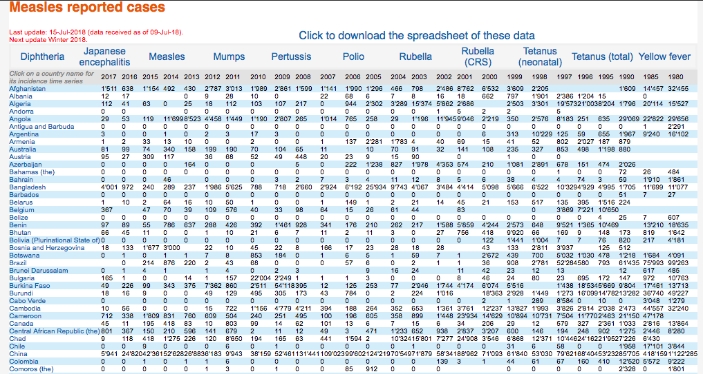
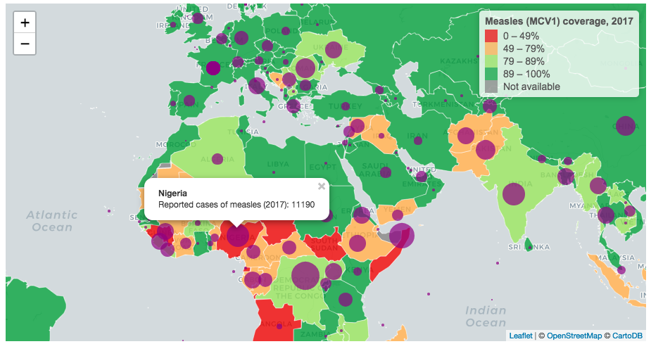
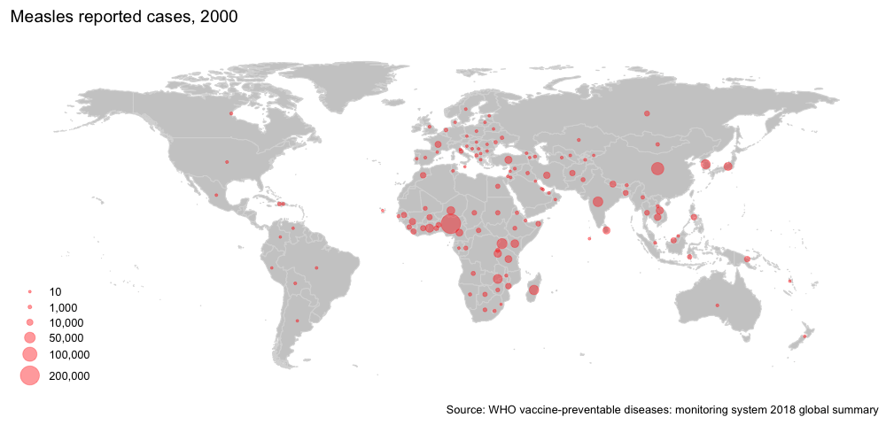

who-web-scrape
================

# Disease incidence and immunization coverage: An exercise in data scraping and visualization 🗺 👩‍⚕ 🔍

### Motivation

WHO makes a plethora of immunization-related datasets available
[online](http://www.who.int/immunization/monitoring_surveillance/data/en/);
however, as typically encountered when working with public datasets from
international organizations, data are presented as tricky html tables or
machine-unfriendly spreadsheets 🤖 💥

Here we will use `rvest`, `readxl`, and `tidyverse` to scrape WHO
measles data, clean and compile a tidy dataset, and create an
interactive map.

### Web scrape

As you see below, WHO presents incidence data by country from 1980 to
2017 for 11 different diseases in html tables or an Excel spreadsheet.



By inspecting the webpage in the browser ([see here for a brief
tutorial](https://blog.rstudio.com/2014/11/24/rvest-easy-web-scraping-with-r/)),
we see that the third table element contains the data. `rvest` functions
`html_nodes` and `html_table` allow us to scrape the data from that
table element and pull them into a dataframe.

``` r
# parse the html
base_url <- "http://apps.who.int/immunization_monitoring/globalsummary/timeseries/tsincidence"
html     <- read_html(str_c(base_url, "measles"))

# grab the third table element and extract its contents
measles_df <- html %>%
  html_nodes("table") %>% 
  .[[3]] %>%
  html_table(fill = TRUE, trim = TRUE, header = TRUE) %>%
  as_data_frame()

# inspect the output
measles_df
#> # A tibble: 195 x 27
#>    `Click on a cou… `2017` `2016` `2015` `2014` `2013` `2012` `2011` `2010` `2009` `2008` `2007`
#>    <chr>            <chr>  <chr>  <chr>  <chr>  <chr>  <chr>  <chr>  <chr>  <chr>  <chr>  <chr> 
#>  1 Afghanistan      1'511  638    1'154  492    430    2'787  3'013  1'989  2'861  1'599  1'141 
#>  2 Albania          12     17     ""     ""     0      9      28     10     0      ""     22    
#>  3 Algeria          112    41     63     0      25     18     112    103    107    217    0     
#>  4 Andorra          0      0      ""     ""     0      0      0      0      0      0      0     
#>  5 Angola           29     53     119    11'699 8'523  4'458  1'449  1'190  2'807  265    1'014 
#>  6 Antigua and Bar… 0      0      0      0      0      0      0      0      0      0      0     
#>  7 Argentina        3      0      0      1      0      2      3      17     3      0      0     
#>  8 Armenia          1      2      33     13     10     0      0      2      0      0      1     
#>  9 Australia        81     99     74     340    158    199    190    70     104    65     11    
#> 10 Austria          95     27     309    117    ""     36     68     52     49     448    20    
#> # ... with 185 more rows, and 15 more variables: `2006` <chr>, `2005` <chr>, `2004` <chr>,
#> #   `2003` <chr>, `2002` <chr>, `2001` <chr>, `2000` <chr>, `1999` <chr>, `1998` <chr>,
#> #   `1997` <chr>, `1996` <chr>, `1995` <chr>, `1990` <chr>, `1985` <chr>, `1980` <chr>
```

#### Clean up the dataframe

Now that we have a dataframe of the reported measles cases, we want to
do some cleaning. First, there are quite a lot of empty strings in the
table so we want to ensure those are explicit `NA` values. Next, we want
to remove the thousands separator which is curiously an apostrophe.
Lastly, we want to convert the data type for cases and years from
`<chr>` to `<int>`.

``` r
measles_cases_df <- measles_df %>% 
  na_if("") %>%                      # coerce blanks to explicit NAs
  rename(country = 1) %>%            # rename first column
  drop_na(country) %>%               # drop any errant rows with NAs for country
  gather(year, cases, -country) %>%  # reshape df
  mutate_at(vars(-country), funs(str_replace_all(., "'", ""))) %>%  # remove apostrophe thousands separator
  mutate_at(vars(-country), funs(as.integer))                       # convert cases to integer

# Let's wrap these steps into a function for later use
clean_web_table <- function(df) {
  df %>%
    as_data_frame() %>% 
    na_if("") %>%            
    rename(country = 1) %>%  
    drop_na(country) %>%
    gather(year, cases, -country) %>%
    mutate_at(vars(-country), funs(str_replace_all(., "'", ""))) %>%
    mutate_at(vars(-country), funs(as.integer))
}
```

#### Scrape, clean, and compile all disease incidence tables

Let’s now adapt our approach so that we can scrape all the available
incidence data. To start, we build a vector containing each of the
available disease tables. Using `purrr`, we parse each page’s html
content and table as before and use `map_df` and `clean_web_table` to
pull the output into a tidy
dataframe.

``` r
diseases <- c("diphtheria","japenc","measles","mumps","pertussis","rubella","crs","ntetanus","ttetanus","yfever")

diseases %>% 
  set_names() %>%                               # set disease names for iteration and .id variable
  map_df(
    ~str_c(base_url, .x) %>%                    # build urls
    read_html() %>%                             # parse html per page
    html_nodes("table") %>%                     # specify table elements
    .[[3]] %>%                                  # grab third table
    html_table(fill = TRUE, header = TRUE) %>%  # process table
    clean_web_table(),                          # clean up dfs 
  .id = "disease"                               # name the id column
  )
#> # A tibble: 43,650 x 4
#>    disease    country              year cases
#>    <chr>      <chr>               <int> <int>
#>  1 diphtheria Afghanistan          2017     1
#>  2 diphtheria Albania              2017     0
#>  3 diphtheria Algeria              2017     0
#>  4 diphtheria Andorra              2017     0
#>  5 diphtheria Angola               2017    NA
#>  6 diphtheria Antigua and Barbuda  2017     0
#>  7 diphtheria Argentina            2017     0
#>  8 diphtheria Armenia              2017     0
#>  9 diphtheria Australia            2017     8
#> 10 diphtheria Austria              2017     0
#> # ... with 43,640 more rows
```

### Process spreadsheet data

Spreadsheets encountered in the wild are often filled with non-tabular
data containing row headers, multi-level headers, formatting as data,
and/or multiple tables represented across the same sheet ([see this
article for spreadsheet best
practices](https://amstat.tandfonline.com/doi/full/10.1080/00031305.2017.1375989#.W3mcApNKjeQ)).
And, dealing with public datasets from large international organizations
is no exception.

Let’s grab national immunization coverage estimates to complement the
measles incidence data we already scraped. Fortunately, the workbook for
these coverage estimates is straightforward to load and clean, as it
uses consistent wide data structures and lacks many of the usual
spreadsheet quirks 🥂

Note: I adhere to the [project-oriented
workflow](https://www.tidyverse.org/articles/2017/12/workflow-vs-script/)
lifestyle, thus the liberal use of `here::here()` from here onwards.

``` r
# grab WHO immunization coverage estimates
download.file("http://www.who.int/entity/immunization/monitoring_surveillance/data/coverage_estimates_series.xls?ua=1",
              here("data", "coverage_estimates_series.xls"))

# peek at the sheet names for measles (MCV1) and note any extraneous sheets (Readme; Regional Global estimates)
here("data", "coverage_estimates_series.xls") %>% 
  excel_sheets()
#>  [1] "Readme WHOUNICEF"          "BCG"                       "DTP1"                     
#>  [4] "DTP3"                      "HepB_BD"                   "HepB3"                    
#>  [7] "Hib3"                      "IPV1"                      "MCV1"                     
#> [10] "MCV2"                      "PCV3"                      "Pol3"                     
#> [13] "RCV1"                      "RotaC"                     "YFV"                      
#> [16] "Regional Global estimates"

read_excel(here("data", "coverage_estimates_series.xls"), sheet = "MCV1")
#> # A tibble: 194 x 42
#>    Region ISO_code Cname Vaccine `2017` `2016` `2015` `2014` `2013` `2012` `2011` `2010` `2009`
#>    <chr>  <chr>    <chr> <chr>    <dbl>  <dbl>  <dbl>  <dbl>  <dbl>  <dbl>  <dbl>  <dbl>  <dbl>
#>  1 EMR    AFG      Afgh… MCV1        62     62     62     60     57     59     64     62     60
#>  2 EUR    ALB      Alba… MCV1        96     96     97     98     99     98     99     99     97
#>  3 AFR    DZA      Alge… MCV1        88     94     95     95     95     95     95     95     92
#>  4 EUR    AND      Ando… MCV1        99     97     96     96     95     98     99     99     98
#>  5 AFR    AGO      Ango… MCV1        42     45     51     56     59     67     60     67     53
#>  6 AMR    ATG      Anti… MCV1        88     88     91     93     96     98     99     98     99
#>  7 AMR    ARG      Arge… MCV1        89     90     89     95     94     94     95     95     96
#>  8 EUR    ARM      Arme… MCV1        96     97     97     97     97     97     97     97     96
#>  9 WPR    AUS      Aust… MCV1        95     95     95     94     94     94     94     94     94
#> 10 EUR    AUT      Aust… MCV1        96     95     96     96     92     88     84     80     76
#> # ... with 184 more rows, and 29 more variables: `2008` <dbl>, `2007` <dbl>, `2006` <dbl>,
#> #   `2005` <dbl>, `2004` <dbl>, `2003` <dbl>, `2002` <dbl>, `2001` <dbl>, `2000` <dbl>,
#> #   `1999` <dbl>, `1998` <dbl>, `1997` <dbl>, `1996` <dbl>, `1995` <dbl>, `1994` <dbl>,
#> #   `1993` <dbl>, `1992` <dbl>, `1991` <dbl>, `1990` <dbl>, `1989` <dbl>, `1988` <dbl>,
#> #   `1987` <dbl>, `1986` <dbl>, `1985` <dbl>, `1984` <dbl>, `1983` <dbl>, `1982` <dbl>,
#> #   `1981` <dbl>, `1980` <dbl>

# let's reshape, clean the table, and create a dataframe for later use
measles_cvg_df <- read_excel(here("data", "coverage_estimates_series.xls"), sheet = "MCV1") %>% 
  gather(year, coverage, -c(1:4)) %>%
  na_if("") %>%
  rename(country = Cname) %>%  
  clean_names() %>%  # handy function from janitor() to harmonize variable name format
  mutate_at(vars(year, coverage), as.integer) %>% 
  select(-region)

measles_cvg_df
#> # A tibble: 7,372 x 5
#>    iso_code country             vaccine  year coverage
#>    <chr>    <chr>               <chr>   <int>    <int>
#>  1 AFG      Afghanistan         MCV1     2017       62
#>  2 ALB      Albania             MCV1     2017       96
#>  3 DZA      Algeria             MCV1     2017       88
#>  4 AND      Andorra             MCV1     2017       99
#>  5 AGO      Angola              MCV1     2017       42
#>  6 ATG      Antigua and Barbuda MCV1     2017       88
#>  7 ARG      Argentina           MCV1     2017       89
#>  8 ARM      Armenia             MCV1     2017       96
#>  9 AUS      Australia           MCV1     2017       95
#> 10 AUT      Austria             MCV1     2017       96
#> # ... with 7,362 more rows
```

Now that we are familiar with the workbook, let’s iterate through each
sheet to extract all data from the workbook. We can also pipe all of our
reshape and cleaning steps to compile a tidy dataset in one pass.

``` r
excel_path <- here("data", "coverage_estimates_series.xls")

excel_path %>% 
  excel_sheets() %>% 
  .[-c(1,length(.))] %>%  # drop first and last sheets
  set_names() %>% 
  map_df(
    ~read_excel(path = excel_path, sheet = .x, trim_ws = TRUE) %>% 
      gather(year, coverage, -c(1:4)) %>%
      na_if("") %>%
      rename(country = Cname) %>%
      clean_names() %>% 
      mutate_at(vars(year, coverage), as.integer) %>% 
      select(-region)
    )
#> # A tibble: 94,662 x 5
#>    iso_code country     vaccine  year coverage
#>    <chr>    <chr>       <chr>   <int>    <int>
#>  1 AFG      Afghanistan BCG      2017       74
#>  2 ALB      Albania     BCG      2017       99
#>  3 DZA      Algeria     BCG      2017       99
#>  4 AGO      Angola      BCG      2017       83
#>  5 ARG      Argentina   BCG      2017       95
#>  6 ARM      Armenia     BCG      2017       99
#>  7 AUT      Austria     BCG      2017       NA
#>  8 AZE      Azerbaijan  BCG      2017       97
#>  9 BGD      Bangladesh  BCG      2017       99
#> 10 BLR      Belarus     BCG      2017       98
#> # ... with 94,652 more rows
```

### Visualize

Ok, now we have reported cases of measles as well as estimated
vaccination coverage for measles. Let’s use `rnaturalearth` to grab the
global mapping data and then employ `leaflet` to build an interactive
choropleth map to visualize 2017 reported cases and immunization
coverage for measles.

``` r
# prep cases and coverage data (2017) for map
measles_cases_map_dta <- measles_cases_df %>% 
  mutate(iso_code = countrycode(country, "country.name", "iso3c"),    # key for naturalearth join
         iso_code = replace(iso_code, country == "Eswatini", "SWZ"),  # previously Swaziland
         # set bubble size
         bubble_radius = findInterval(cases, c(0,25,50,100,500,1000,5000,10000,20000,40000))*2) %>%
  filter(year == 2017) %>%
  select(-country, -year)

measles_cvg_map_dta <- measles_cvg_df %>% 
  filter(year == 2017) %>% 
  select(-year)

# download dataset of latitude/longitude by country for bubble placements
download.file("https://opendata.socrata.com/api/views/mnkm-8ram/rows.csv?accessType=DOWNLOAD",
              here("data", "lat_lon.csv"))

lat_lon <- read_csv(here("data", "lat_lon.csv")) %>% 
  select(iso_a3 = `Alpha-3 code`, lat = `Latitude (average)`, lon = `Longitude (average)`) %>% 
  add_row(iso_a3 = "SSD", lat = 6.9, lon = 31.3)  # South Sudan was missing

# load naturalearth data
map_dta <- ne_countries(scale = 50, returnclass = "sf") %>% 
  # address some missing iso3 codes
  mutate(iso_a3 = replace(iso_a3, sovereignt == "France", "FRA"),
         iso_a3 = replace(iso_a3, sovereignt == "Denmark", "DNK"),
         iso_a3 = replace(iso_a3, sovereignt == "Norway", "NOR")) %>% 
  select(iso_a3) %>% 
  # join reported cases, coverage, and lat/lon data to naturalearth data
  left_join(., measles_cases_map_dta, by = c("iso_a3" = "iso_code")) %>% 
  left_join(., measles_cvg_map_dta, by = c("iso_a3" = "iso_code")) %>% 
  left_join(., lat_lon, by = "iso_a3")

# set palette and tooltip formats
cvg_pal   <- colorBin(palette = "RdYlGn", 
                      domain = map_dta$coverage,
                      bins = c(0,49,79,89,100),
                      reverse = FALSE)
cases_lbl <- str_glue("<b>{map_dta$country}</b><br>
                      Reported cases of measles (2017): {map_dta$cases}")
cvg_lbl   <- str_glue("<b>{map_dta$country}</b><br>
                      MCV1 coverage (2017): {map_dta$coverage}%")

# build map
leaflet(data = map_dta) %>%
  setView(lat = 25, lng = 30, zoom = 2.5) %>%
  addProviderTiles("CartoDB.Positron", group = "Simple") %>%
  # immunization coverage
  addPolygons(
    fillColor = ~cvg_pal(coverage),
    weight = 1,
    color = "white",
    fillOpacity = 0.8,
    popup = cvg_lbl
    ) %>% 
  # reported cases
  addCircleMarkers(
    lng = ~lon, lat = ~lat,
    radius = ~bubble_radius,
    fillOpacity = 0.7,
    color = "purple",
    stroke = FALSE,
    popup = cases_lbl
    ) %>% 
  addLegend(
    pal = cvg_pal, 
    values = ~map_dta$coverage,
    title = "Measles (MCV1) coverage, 2017",
    position = "topright", 
    opacity = 0.7,
    na.label = "Not available",
    labFormat = labelFormat(
      suffix = "%",
      transform = function(coverage) sort(coverage, decreasing = FALSE)
      )
    )
```

As the rmarkdown `github_document` output format does not support
interactive `leaflet` maps, here is a static image of the map generated
from the above code:



The hmtl file containing the interactive `leaflet` map can be found
[here](who-web-scrape.html).

Let’s use the excellent `gganimate` package to create an animated map of
annually reported measles cases since 2000.

``` r
# set up measles cases dataframe for mapping
lat_lon <- read_csv(here("data", "lat_lon.csv")) %>% 
  select(iso_a3 = `Alpha-3 code`, lat = `Latitude (average)`, lon = `Longitude (average)`) %>% 
  add_row(iso_a3 = "SSD", lat = 6.9, lon = 31.3)  # South Sudan was missing

map_anim_df <- measles_cases_df %>%  
  mutate(
    iso_code = countrycode(country, "country.name", "iso3c"),   # key for lat/lon join
    iso_code = replace(iso_code, country == "Eswatini", "SWZ")  # previously Swaziland
    ) %>% 
  left_join(., lat_lon, by = c("iso_code" = "iso_a3")) %>% 
  na_if(0) %>%  # suppress zeros as we only want cases
  filter(year >= 2000)
           
# build animated map
map_anim <- ggplot(data = map_anim_df) +
  borders(database = "world", colour = "gray85", fill = "gray80") + 
  geom_point(aes(x = lon, y = lat, size = cases), colour = "red", alpha = 0.4) +
  scale_size_continuous(labels = scales::comma, 
                        breaks = c(10,1000,10000,50000,100000,200000),
                        range = c(1, 10)) + 
  scale_y_continuous(limits = c(-60, 90)) +  # exclude Antarctica
  coord_quickmap() + 
  labs(title = "Measles reported cases, {frame_time}",
       caption = "Source: WHO vaccine-preventable diseases: monitoring system 2018 global summary",
       size  = "") +
  theme_map(base_size = 16) + 
  transition_time(year)

animate(map_anim, nframes = 18, fps = 1, detail = 2, length = 36, width = 1000)
anim_save(here("images", "measles_anim.gif"))
```


